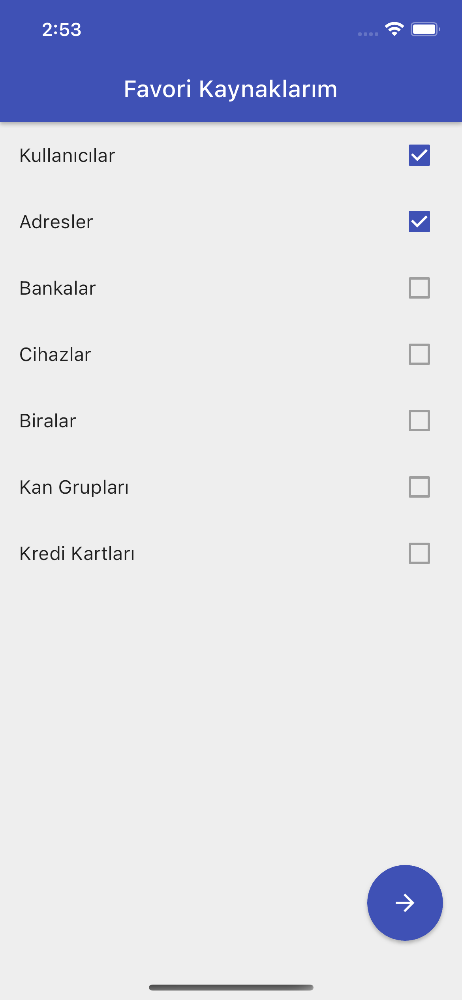

# PayTR Test Case

### Açıklama

Projede state management için riverpod kullanılmıştır. Proje yapısı clean architecture'ın riverpod için uyarlanmış halidir.  
Routing için auto_route kütüphanesi kullanılmıştır. Routing işlemleri için app_router.dart dosyası kullanılmıştır.  
Api'den yanıt alınamaması durumda dio cache interceptor devreye girip en son alınan yanıtı döndürmektedir.  

#### Sayfalar
- Onboarding -> favorilerin seçildiği, ad,soyad, yaş bilgilerinin girildiği ekran.
- Home -> favorilerin ve diğer kaynakların listelendiği ekran.
- DetailList -> kaynakların geçmiş verilerinin listelendiği ve yeni verilerin istendiği ekran.
- Detail -> kaynağın detaylarının görüntülendiği ekran.

#### Ekran Görüntüleri

##### Onboarding
  
  

##### Home

##### Detail List
  

##### Details
  

